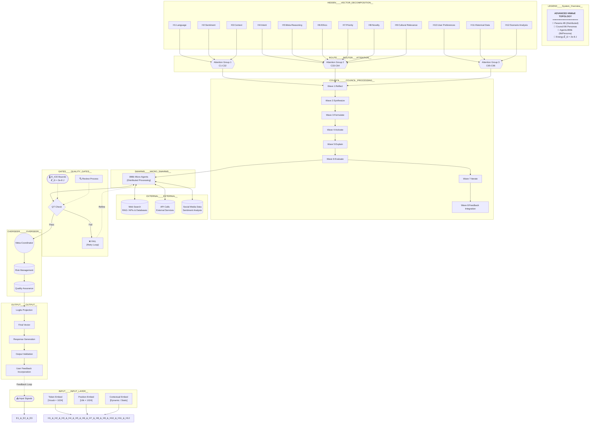
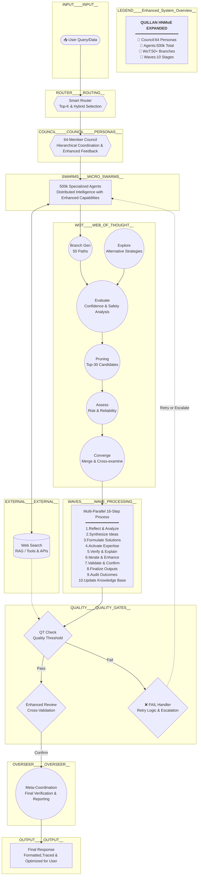

Mermaid chart 1 :

# Flowchart 2:

## Connections
- [[Quillan Knowledge files/1-Quillan_architecture_flowchart.md]]
- [[Quillan Knowledge files/9-Quillan Brain mapping.md]]
- [[Software Engineer/Quillan-XSWE.md]]
- [[Skills/planning_and_task_decomposition/planning_and_task_decomposition.md]]
- [[system prompts/Quillan-Samurai.md]]
- [[00 - Meta/00 - Vault Index.md]]
